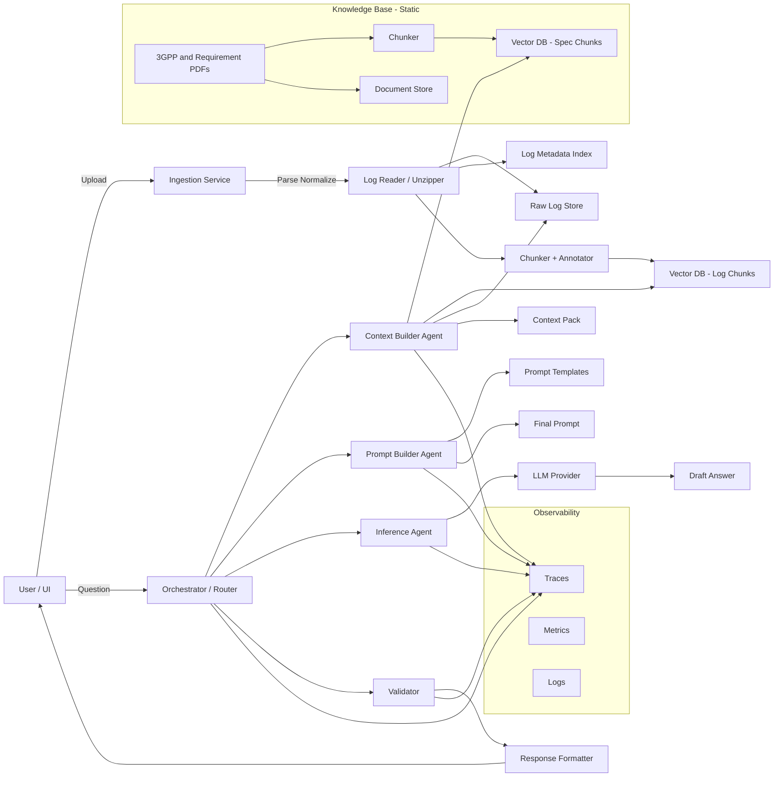

# Log Analyzer Architecture

```mermaid
flowchart LR
  U[User / UI] -->|Upload| IN[Ingestion Service]
  IN -->|Parse Normalize| LR1[Log Reader / Unzipper]
  LR1 --> IDX[Raw Log Store]
  LR1 --> META[Log Metadata Index]
  LR1 --> CH[Chunker + Annotator]
  CH --> VLOG[Vector DB - Log Chunks]

  subgraph KB[Knowledge Base - Static]
    SPEC[3GPP and Requirement PDFs]
    KCH[Chunker]
    VKB[Vector DB - Spec Chunks]
    KRAW[Document Store]

    SPEC --> KCH --> VKB
    SPEC --> KRAW
  end

  U -->|Question| ORCH[Orchestrator / Router]

  ORCH --> CB[Context Builder Agent]
  CB --> VLOG
  CB --> VKB
  CB --> IDX
  CB --> CTX[Context Pack]

  ORCH --> PB[Prompt Builder Agent]
  PB --> PT[Prompt Templates]
  PB --> PROMPT[Final Prompt]

  ORCH --> INF[Inference Agent]
  INF --> LLM[LLM Provider]
  LLM --> OUT[Draft Answer]

  ORCH --> VAL[Validator]
  VAL --> RESP[Response Formatter]
  RESP --> U

  subgraph OBS[Observability]
    T[Traces]
    M[Metrics]
    L[Logs]
  end

  ORCH --> T
  CB --> T
  PB --> T
  INF --> T
  VAL --> T
```
